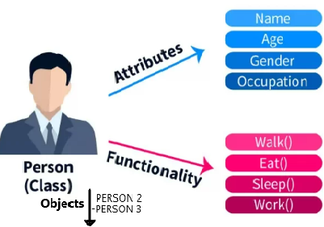
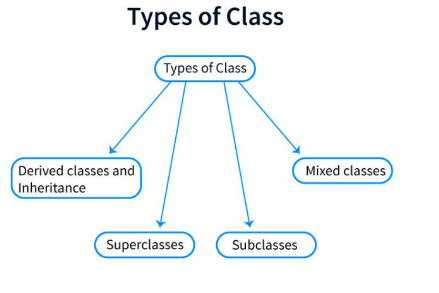
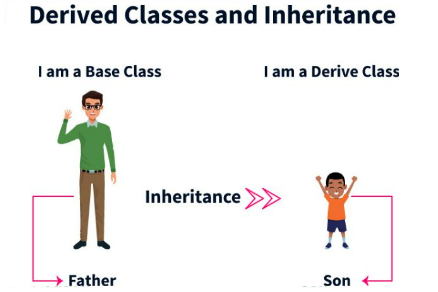
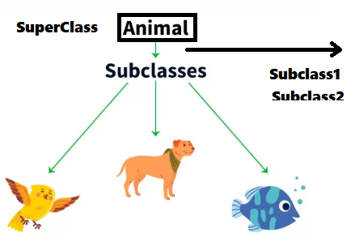

# code-learn
codes, Frameworks, basic definition, Cheets sheats, short Tricks.
---
    
   
---

### self
The word 'self' is used to represent the instance of a class. By using the "self" keyword we access the attributes and methods of the class in python.

### _ _ init _ _ method
"_ _ init _ _" is a reseved method in python classes. It is called as a constructor in object oriented terminology. This method is called when an object is created from a class and it allows the class to initialize the attributes of the class.
